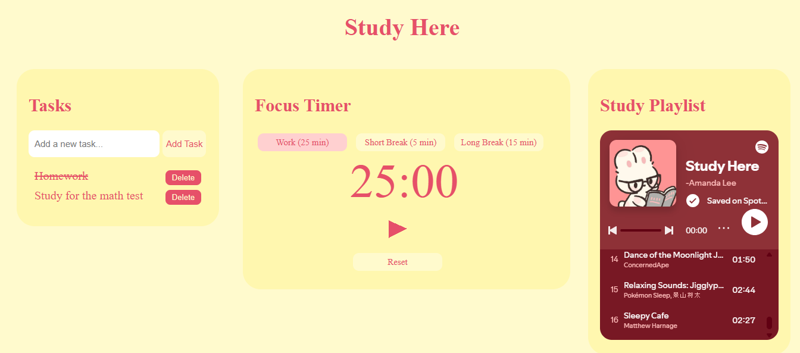
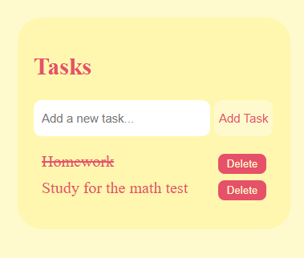
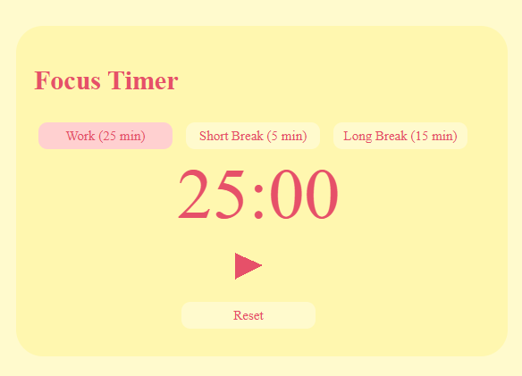

# Study Here
## Description
It's a website for help you focus at your study moment.  
Made with HTML, CSS and JS. 
I created this site as a way of learning some JS, so the code is REALLY poor, but i tried my best :D  

It has a task list, a focus timer and a playlist created by me ^o^

## Use instructions
### Task list

1. Create a new task by writing at the "add a new task" area and clicking on the "add task" button.
2. After concluding the task, click on it and it will be crossed out.
3. If you want to delete any task, just click on the "delete" button.

### Focus timer

1. Change the mode by clicking on any option ("Work","Short break" or "Long break") above the display.
2. Pause or continue the timer by clicking at the button right bellow the display.
3. Reset the timer by clicking on the "reset" button.

## AI use
I used for debugging and learning some JS concepts.
